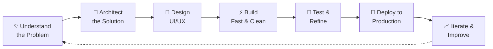

<!-- ============================================================ -->
<!--                    AHMED AQEEL — PROFILE                     -->
<!--                  AI Full Stack Developer                     -->
<!-- ============================================================ -->

<!-- ===== ANIMATED HEADER BANNER ===== -->


<!-- ===== TYPING ANIMATION ===== -->
<div align="center">

[](https://git.io/typing-svg)

</div>

<!-- ===== QUICK ACTION BUTTONS ===== -->
<div align="center">

<a href="https://www.linkedin.com/in/ahmed-aqeel-2a0090271"></a>&nbsp;
<a href="mailto:engrahmedaqeel14@gmail.com"></a>&nbsp;
<a href="https://github.com/devahmedaqeel?tab=repositories"></a>

<br/><br/>


</div>

<br/>

<!-- ===== QUICK NAVIGATION ===== -->
<div align="center">

[](#-about-me) [](#-what-i-do) [](#-featured-projects) [](#%EF%B8%8F-tech-arsenal) [](#-github-analytics) [](#-contribution-snake) [](#-current-focus--2026-roadmap) [](#-lets-work-together)

</div>

<br/>

<!-- ============================================================ -->
<!--                         ABOUT ME                             -->
<!-- ============================================================ -->

## 🧑‍💻 About Me

I'm **Ahmed Aqeel** — a Software Engineering student and **AI Full Stack Product Builder** who takes ideas from **concept → design → development → deployment**. I work at the intersection of modern web engineering and AI, using intelligent tooling to ship complete, production-ready digital products fast.

My approach is **logic-driven**: deeply understand the problem, architect the right solution, then execute with precision — whether that's a responsive web platform, a cross-platform mobile app, or an AI-powered system.

<br/>

| | | | |
| :--- | :--- | :--- | :--- |
| 🎓 **Education** | BS Software Engineering Student | 🤖 **AI Specialization** | Claude, Gemini & Groq APIs |
| 📱 **Mobile Apps** | React Native & Expo Ecosystem | 🌱 **DevOps & Cloud** | Docker, Kubernetes & CI/CD |
| 💼 **Availability** | Freelance & Remote Roles | 📫 **Get in Touch** | [engrahmedaqeel14@gmail.com](mailto:engrahmedaqeel14@gmail.com) |

<br/>

> ⚡ **Fun Fact:** I believe the best code is the code that solves a real problem.


```typescript
interface Developer {
  name: string;
  role: string[];
  architecture: string[];
  currentFocus: string[];
  philosophy: string;
}

const ahmedAqeel: Developer = {
  name: "Ahmed Aqeel",
  role: ["AI Full Stack Developer", "Mobile Developer"],
  architecture: ["Frontend-first", "API-driven", "Serverless", "AI-augmented"],
  currentFocus: ["Cloud & DevOps", "System Design", "Scalable AI Products"],
  philosophy: "Understand the problem first — then build the solution.",
};
```

---

<!-- ============================================================ -->
<!--                       WHAT I DO                              -->
<!-- ============================================================ -->

## 💼 What I Do

<table>
<tr>
<td width="50%" valign="top">

### 🌐 Full Stack Web Development
End-to-end web applications with **React, Next.js, Node.js & Express** — from pixel-perfect responsive UIs to secure, scalable REST APIs, authentication, and database design.

</td>
<td width="50%" valign="top">

### 🤖 AI-Powered Applications
Integrating **Claude, Gemini & Groq APIs** into real products — chatbots, document intelligence, OCR pipelines, AI forecasting, and intelligent automation workflows.

</td>
</tr>
<tr>
<td width="50%" valign="top">

### 📱 Cross-Platform Mobile Apps
Native-quality iOS & Android apps built with **React Native + Expo**, connected to Firebase/Supabase backends with real-time data and push notifications.

</td>
<td width="50%" valign="top">

### ☁️ Deployment & Cloud
Shipping to production on **Vercel, Netlify, Render, AWS & Azure** — with CI/CD via GitHub Actions, containerization with Docker, and performance optimization.

</td>
</tr>
<tr>
<td width="50%" valign="top">

### 🎨 UI/UX & 3D Experiences
Modern, conversion-focused interfaces with **TailwindCSS, Figma & Three.js** — including interactive 3D elements and micro-animations that make products memorable.

</td>
<td width="50%" valign="top">

### 🏢 Business Solutions
Complete digital solutions for real businesses — e-commerce sites, finance dashboards, restaurant menu systems, and custom internal tools.

</td>
</tr>
</table>

---

<!-- ============================================================ -->
<!--                    FEATURED PROJECTS                         -->
<!-- ============================================================ -->

## 🚀 Featured Projects

<table width="100%" border="0" cellpadding="10">
  <tr>
    <!-- Project 1 -->
    <td width="50%" valign="top">
      <h3>🩺 MediReport AI</h3>
      <p>Medical lab report scanner — OCR extracts values from lab reports, AI explains results in plain language, with a companion mobile app.</p>
      <p>
        
        
        
        
      </p>
      <a href="#" target="_blank"></a>
      <a href="#" target="_blank"></a>
    </td>
    <!-- Project 2 -->
    <td width="50%" valign="top">
      <h3>🤖 JARVIS</h3>
      <p>Iron Man–style AI assistant with voice control, automation integrations, and a futuristic animated UI.</p>
      <p>
        
        
        
        
      </p>
      <a href="#" target="_blank"></a>
      <a href="#" target="_blank"></a>
    </td>
  </tr>
  <tr>
    <!-- Project 3 -->
    <td width="50%" valign="top">
      <h3>💰 Ledger (OFM)</h3>
      <p>Organization finance management platform with interactive charts, reporting, and AI-powered financial forecasting.</p>
      <p>
        
        
        
        
      </p>
      <a href="#" target="_blank"></a>
      <a href="#" target="_blank"></a>
    </td>
    <!-- Project 4 -->
    <td width="50%" valign="top">
      <h3>🍽️ Mensa</h3>
      <p>Cloud-based restaurant digital menu management system — real-time menu updates, QR access, and admin dashboard.</p>
      <p>
        
        
        
      </p>
      <a href="#" target="_blank"></a>
      <a href="#" target="_blank"></a>
    </td>
  </tr>
  <tr>
    <!-- Project 5 -->
    <td width="50%" valign="top">
      <h3>🪟 Blinds World Ltd</h3>
      <p>Complete business website redesign for a window blinds company — modern, fast, and conversion-focused.</p>
      <p>
        
        
        
      </p>
      <a href="#" target="_blank"></a>
      <a href="#" target="_blank"></a>
    </td>
    <!-- Project 6 -->
    <td width="50%" valign="top">
      <h3>🛰️ Dev Orbit Tech</h3>
      <p>Agency platform showcasing AI-powered full-stack product development services.</p>
      <p>
        
        
        
      </p>
      <a href="#" target="_blank"></a>
      <a href="#" target="_blank"></a>
    </td>
  </tr>
</table>


<div align="center">

[](https://github.com/devahmedaqeel?tab=repositories)

</div>

---

<!-- ============================================================ -->
<!--                       TECH ARSENAL                           -->
<!-- ============================================================ -->

## 🛠️ Tech Arsenal

<details open>
<summary><b>👨‍💻 Languages</b></summary>
<br/>


</details>

<details open>
<summary><b>🎨 Frontend Development</b></summary>
<br/>


</details>

<details open>
<summary><b>📱 Mobile Development</b></summary>
<br/>


</details>

<details open>
<summary><b>⚙️ Backend Development</b></summary>
<br/>


</details>

<details open>
<summary><b>🗄️ Databases & ORMs</b></summary>
<br/>


</details>

<details open>
<summary><b>🤖 AI / Machine Learning</b></summary>
<br/>


</details>

<details open>
<summary><b>☁️ Cloud, DevOps & Deployment</b></summary>
<br/>


</details>

<details open>
<summary><b>🧰 Tools, Testing & Design</b></summary>
<br/>


</details>

---

<!-- ============================================================ -->
<!--                     HOW I BUILD                              -->
<!-- ============================================================ -->

## 🧭 My Development Workflow



> **Logic first, tools second.** I focus on deeply understanding *what* needs to be built and *why* — then leverage the best modern tooling (including AI) to execute at maximum speed without sacrificing quality.

---

<!-- ============================================================ -->
<!--                    GITHUB ANALYTICS                          -->
<!-- ============================================================ -->

## 📊 GitHub Analytics

<div align="center">


<br/><br/>


<br/><br/>


<br/><br/>


</div>

<!-- ============================================================ -->
<!--                 CONTRIBUTION SNAKE 🐍                        -->
<!--   Auto-switches between dark & light mode on GitHub.         -->
<!--   Requires the snake.yml workflow (see .github/workflows).   -->
<!-- ============================================================ -->

## 🐍 Contribution Snake

<div align="center">

<picture>
  <source media="(prefers-color-scheme: dark)" srcset="https://raw.githubusercontent.com/devahmedaqeel/devahmedaqeel/output/github-contribution-grid-snake-dark.svg" />
  <source media="(prefers-color-scheme: light)" srcset="https://raw.githubusercontent.com/devahmedaqeel/devahmedaqeel/output/github-contribution-grid-snake.svg" />
  
</picture>

<sub>🟩 The snake eats my daily contributions — updated automatically every night via GitHub Actions</sub>

</div>

---

<!-- ============================================================ -->
<!--                  CURRENTLY / ROADMAP                         -->
<!-- ============================================================ -->

## 🎯 Current Focus & 2026 Roadmap

| Status | Goal |
| :---: | :--- |
| 🟢 | Mastering **Docker & containerized deployments** |
| 🟢 | Building & shipping **AI-powered SaaS products** |
| 🟡 | Deep-diving into **Kubernetes & cloud architecture (AWS/Azure)** |
| 🟡 | Strengthening **system design & scalability patterns** |
| 🔵 | Growing **Dev Orbit Tech** into a full product studio |
| 🔵 | Contributing to **open-source AI tooling** |

`🟢 In progress` `🟡 Up next` `🔵 Long-term`

---

<!-- ============================================================ -->
<!--                   LET'S WORK TOGETHER                        -->
<!-- ============================================================ -->

## 🤝 Let's Work Together

<div align="center">

**Have a project in mind? Need a full-stack developer who ships complete products?**

I'm currently available for **freelance projects** and **remote opportunities** — from MVPs and business websites to AI-powered applications and mobile apps.

<br/>

<a href="mailto:engrahmedaqeel14@gmail.com"></a>

<br/><br/>

[](https://www.linkedin.com/in/ahmed-aqeel-2a0090271)
[](https://x.com/mrahmedaqeel7)
[](https://www.instagram.com/a.aqeel14?igsh=ZTltZ3Jlc28xazRh&utm_source=qr)
[](https://www.facebook.com/share/19PssU8jxG/?mibextid=wwXIfr)
[](https://www.tiktok.com/@ahmedaqeel_)
[](https://www.reddit.com/u/Emotional_Revenue751)

</div>

---

<!-- ============================================================ -->
<!--                        FOOTER                                -->
<!-- ============================================================ -->

<div align="center">

### ⚡ _"Understand the problem first — then build the solution."_

<br/>


<br/>

**⭐ If you find my work interesting, consider starring a repo — it helps a lot!**


</div>
